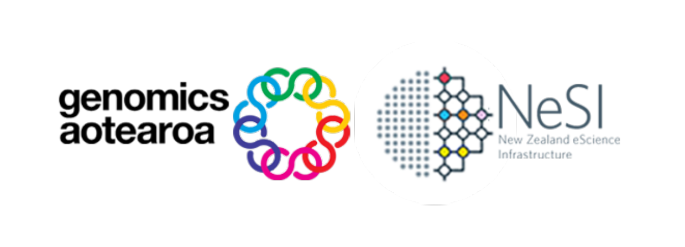

# **Intermediate Shell for Bioinformatics**

{width="300"}

 

 
 

<!--- check -->

| **Lesson**                                         | **Overview** | 
|:---------------------------------------------------|:-------------|
|1. [Download and verify data](./2_download_data.md)|Downloading data with `wget`/`curl` and check the transferred data’s integrity with check‐sums|
|2. [Streams, Redirection and Pipe](./3_streams_red_pipe.md)|Combining pipes and redirection, Using "Exit" statuses|
|3. [Inspecting and Manipulating Text Data with UNIX Tools - Part 1](./4_inspectmanipluate.md)| Inspect file/s with utilities such as `head`,`less`. Extracting and formatting tabular data. Magical `grep`. |
|4. [Inspecting and Manipulating Text Data with UNIX Tools - Part 2](./5_inspectmanipulate2.md)|Substitute matching patterns with `sed`. Text processing with `awk` and `bioawk`|
|5. [Automating File-Processing with find and xargs](./6_automate_fileprocessing_find_xargs.md)| Search files by pattern with `find` and use `xargs` to execute a command for those objects matching the pattern|
|6. [Puzzles](./puzzles.md) 🧩 | Can you use shell scripts to solve these "real" life challenged in molecular biology ?|
|7. [Supplementary - 1](./supplementary%20/supplementary_1.md) | Recap - Unix , Linux and Unix shell|
|8. [Supplementary - 1](./supplementary%20/supplementary_2.md) | Recap - Shell basics and commands  |
|11. [Supplementary_3](./supplementary%20/supplementary_3.md)| Escaping, Special Characters|

- - - 

!!! copyright "Attribution Notice"

    * This workshop material is heavily inspired by : 
        1. Buffalo, V (2015). ***Bioinformatics Data Skills***.O'Reilly Media, Inc
        2. The Carpentries. ***The Unix Shell*** . https://swcarpentry.github.io/shell-novice/
        3. The Carpentries. ***Introduction to Command Line for Genomics***. https://datacarpentry.org/shell-genomics/
        4. Rosalind Project. https://rosalind.info/about/
    
- - - 

!!! key "License" 

    Genomics Aotearoa / New Zealand eScience Infrastructure "Intermediate Shell for Bioinformatics" is licensed under the **GNU General Public License v3.0, 29 June 2007** . ([Follow this link for more information](https://github.com/GenomicsAotearoa/shell-for-bioinformatics/blob/main/LICENSE))
    
- - - 

!!! screwdriver-wrench "Setup"

    - If possible, we do recommend using the **Remote** option over **Local**  ( Especially for *Windows* hosts). This will eliminate  the need to install any additional applications

    - **Remote** option will require an existing NeSI Account

    ### Remote
    
    ??? info "Log into NeSI Mahuika Jupyter Service"
    
        1. Follow [https://jupyter.nesi.org.nz/hub/login](https://jupyter.nesi.org.nz/hub/login)
        2. 
Enter NeSI username, HPC password and 6 digit second factor token 

        3. 
Choose server options as below
         >>make sure to choose the correct project code `nesi02659`, number of CPUs `CPUs=4`, memory `8 GB` prior to pressing {width="40"}  button.
    
         
    
    ### Local  :warning:
    
    
    
    ??? info "Local host setup - Windows, MacOS & Linux"
    
        === "Windows Hosts"
    
            * Install either 
              - Git for Windows from [https://git-scm.com/download/win](https://git-scm.com/download/win) **OR**
              - MobaXterm Home (*Portable* or *Installer* edition) from [https://mobaxterm.mobatek.net/download-home-edition.html](https://mobaxterm.mobatek.net/download-home-edition.html)
                  * Portable edition does not require administrative privileges 
    
        === "MacOS"
    
              * Native terminal client is sufficient.
              * It might not comes with `wget` download data via command line (can be installed with `$ brew install wget`)
              * However, it is not required as we provide a direct link to download data in .zip format 
    
        === "Linux"
    
              * Native terminal client is sufficient.
    
        !!! warning "`bioawk` install on all hosts"
    
            One of the tools used in this workshop is `bioawk` which is not a native Linu/UNIX utility. Installing it on MacOS and Linux can be done with `$ brew install bioawk` & `$ sudo apt install bioawk`, respectively. Windows hosts might have to do it via `conda` according to [these instructions](https://anaconda.org/bioconda/bioawk). However, this will require a prior install of **Anaconda** Or **Miniconda** 
    
    
    